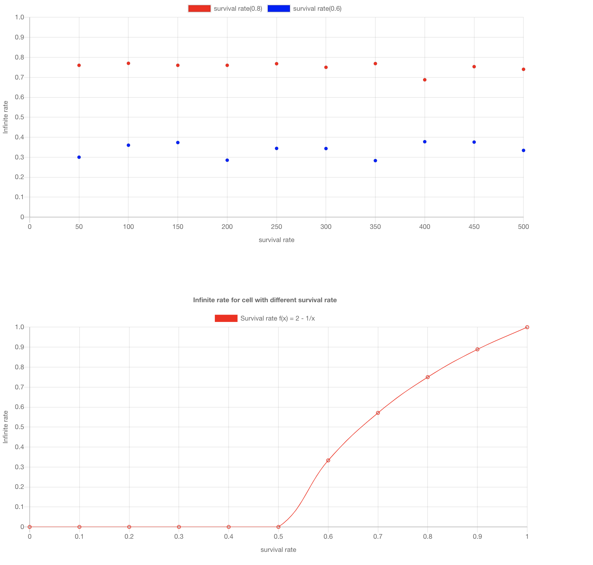

# Overview

The purpose of this project is about simulating the infinite rate for a cell with a certain survival rate

E.g
If a cell with replicated rate 0.8 and dead rate 0.2 then the infinite rate for the cell to survival in an infinite time is close to 0.75

Now the fun part is about how we get this rate, check below

This project use two different ways to calculate the rate

1. The first image attaches below is about in the simulation method, to run 500 times(we can even run more times), we got the infinite rate (0.75 and 0.334) with 2 potential survival rate 0.8(red) and 0.6(blue)

2. The second image shows the math analytical method, when the survival rate is 0.8, which means in the next generation we need to at least have one cell that can replicate infinitely
the function is f(x) = 2 - 1/x we get the infinite rate 0.75

## How to run 
* git clone this project
* cd this project
* npm install
* yarn start and open the url

## Key technologies
* TypeScript
* chartjs
* React
